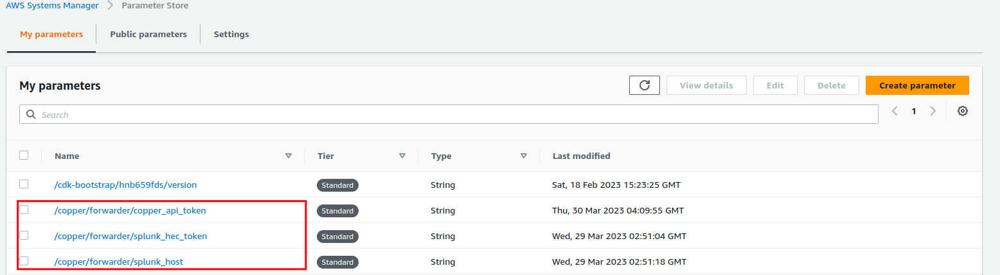
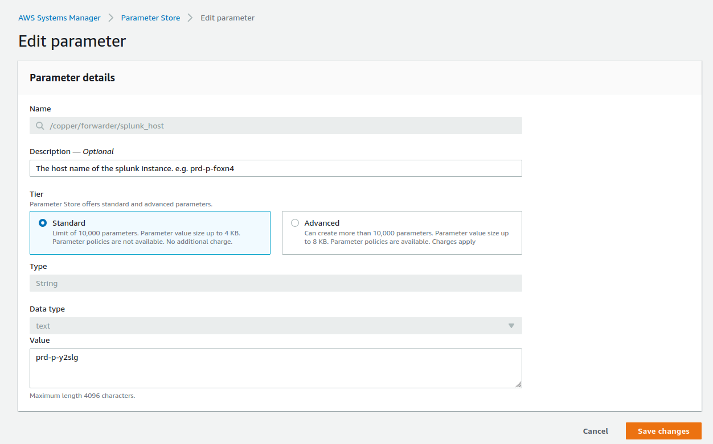
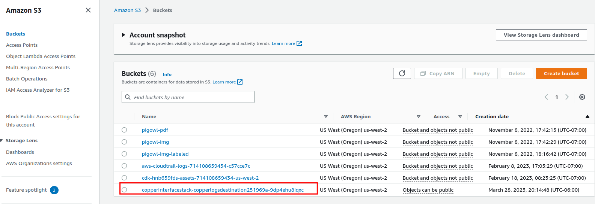

# Copper Interface

This repository contains infrastructure as code to quickly get started with the Copper API.

In short, to use our API:

1. Gather your JSON Log data (we're working on other formats)
2. Send it to our API ('https://api.cwolves.com/api/v1/')

For any questions, feature requests, or suggestions reach out to thatcher@cwolves.com. I respond quickly!

## Copper API

The Copper API sits between your log producers and your SIEM. It doesn't matter where these producers exist as long as they can send their JSON log data to the Copper API over the internet.  

NOTE: We are **actively** developing capability to accept XML data.

One way to use our API is to push all of your logs to a bucket and use a Lambda to forward them to the Copper API. Our API will return the slashed data to you and  This repository is allows you to instantly set up the AWS resources via their CDK for this pattern.

Additionally, this repository contains an example Python script that shows how to send logs to the Copper API directly.

## Quickest Start (Python Script)

Use the example Python script `send_logs.py` to send logs to our api. You will need to update the `splunk_host`, `splunk_hec_token`, and `api_token` variables with your own values.

## Quick Start (AWS CDK)

### Prerequisites

- npm, Node.js [Install](https://nodejs.org/en/download/)
- Python [Install](https://www.python.org/downloads/)
- AWS Account [Sign Up](https://aws.amazon.com/)
- AWS CLI Access [Instructions](https://docs.aws.amazon.com/cli/latest/userguide/cli-chap-configure.html)
- AWS CDK [Guide](https://docs.aws.amazon.com/cdk/latest/guide/getting_started.html)
- Splunk HEC Endpoint [Guide](https://docs.splunk.com/Documentation/Splunk/latest/Data/UsetheHTTPEventCollector)

0. Prerequisites  
    Install Libraries  
    `npm i -g aws-cdk`  
    `pip install -r requirements.txt`  
    [Sign Up](https://cwolves.com) for a Cwolves Account
1. Clone this repository onto your local machine.

    `git clone git@github.com:arctype-dev/copper-interface.git`

2. Change into the directory.

    `cd copper-interface`

3. Bootstrap the CDK. This creates a stack with the resources required to deploy a stack via the CDK. You can see the stack in CloudFormation.

    `cdk bootstrap`

4. Deploy the stack. This creates the resources in your AWS account. You can see the stack in CloudFormation.

    `cdk deploy`

5. Update the SSM parameters with your Splunk configuration.
    In your AWS console, go to Systems Manager > Parameter Store. You should see three parameters that were created by the stack. Update the values with your Splunk configuration and token from [Cwolves Dashboard](https://cwolves.com/dashboard).

    

    Edit each parameter and update the values.

    

6. Now that everything is set up, drop files into the bucket `copperinterfacestack-copperlogsdestination`. The files should be in the json format. The files will be processed, reduced in size, and sent to the Splunk HEC endpoint you configured.

    

7. At anytime, if you'd like to completely the resources you created:

    `cdk destroy`

## CDK Resources

This stack creates resources that will enable you to drop logs into a bucket, and have the slashed version sent to Splunk.

### Log Bucket

The stack includes a single bucket to drop logs into. Simply upload a file with you logs in the json format. This bucket is NOT for long term storage, the files are deleted once they are processed by the forwarder lambda.

#### Lambda Event Notification

The bucket is configured to send an event notification to a lambda function when a file is dropped into the bucket. This will trigger the lambda to pull the file from the bucket and send it to Copper for processing along with your Splunk configuration parameters.

### Systems Manager Parameter Store

The stack initializes three parameters that you need to update with your own values. The first is `splunk_host` which is the hostname of your Splunk instance (e.g. 'prd-p-foxn4'). The second is `splunk_hec_token` which is the Authorization token for a Splunk HEC endpoint that you created. The third is `copper_api_token`

### Forwarder Lambda

The stack creates a lambda function that will be triggered by the bucket. The lambda function will take the file that was dropped into the bucket, and send the api token, splunk secrets, and data to the Copper API. Then, it will delete the file from the bucket.

#### Policies

The lambda function is given a policy to read from SSM Parameter Store within the folder `/copper/logslash/*`
