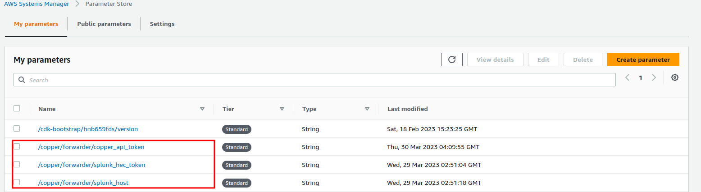

# Quick Start using Terraform

There is a Terraform script `deploy_logslash.tf` which deploys a few resources to your AWS account. The resources are:

- Splunk Host SSM Parameter
- Splunk HEC Token SSM Parameter
- Copper API Token SSM Parameter
- An AWS Bucket
- An AWS Lambda Function
- An AWS Bucket Notification
- There are also several iam related items that you may want to handle yourself.

When files are created in the bucket, the notification triggers the lambda function. The lambda function reads the data from the bucket and reads in the SSM parameters. It batches the data into 6MB chunks, formats it to be sent as an array of strings, and sends it to the Copper API along with the HEC Token, Splunk Host, and API Token.

## Prerequisites

- Terraform [Install](https://learn.hashicorp.com/tutorials/terraform/install-cli)
- AWS Account [Sign Up](https://aws.amazon.com/)
- Splunk HEC Endpoint [Guide](https://docs.splunk.com/Documentation/Splunk/latest/Data/UsetheHTTPEventCollector)

## Instructions

0. Prerequisites
   [Sign Up](https://cwolves.com) for a Cwolves Account
1. Clone this repository onto your local machine.

   `git clone git@github.com:arctype-dev/copper-interface.git && cd copper-interface`

2. Change into the directory.

   `cd terraform`

3. Initialize Terraform.

   `terraform init`

4. Deploy the resources.

   `terraform apply`

5. Create SSM Parameters

   

   Edit each parameter and update the values.

   

## Resources

These are the resources managed by the Terraform script.

### Log Bucket

The stack includes a single bucket to drop logs into. Simply upload a file with you logs in the JSON or XML format.

#### Lambda Event Notification

The bucket is configured to send an event notification to a lambda function when a file is dropped into the bucket. This will trigger the lambda to pull the file from the bucket and send it to Copper for processing along with your Splunk configuration parameters.

### Systems Manager Parameter Store

The stack initializes three parameters that you need to update with your own values. The first is `splunk_host` which is the hostname of your Splunk instance (e.g. 'prd-p-foxn4'). The second is `splunk_hec_token` which is the Authorization token for a Splunk HEC endpoint that you created. The third is `copper_api_token` which is the API token for your Copper account, visit [Copper](https://cwolves.com/dashboard/api-tokens) to get your API token.

### Forwarder Lambda

The stack creates a lambda function that will be triggered by the bucket. The lambda function will take the file that was dropped into the bucket, and send the API token, splunk secrets, and data to the Copper API. Then, it will delete the file from the bucket.

#### Policies

The lambda function is given a policy to read from SSM Parameter Store within the folder `/copper/logslash/*`. It also has policies to read from the bucket and be monitored with cloudwatch. 
